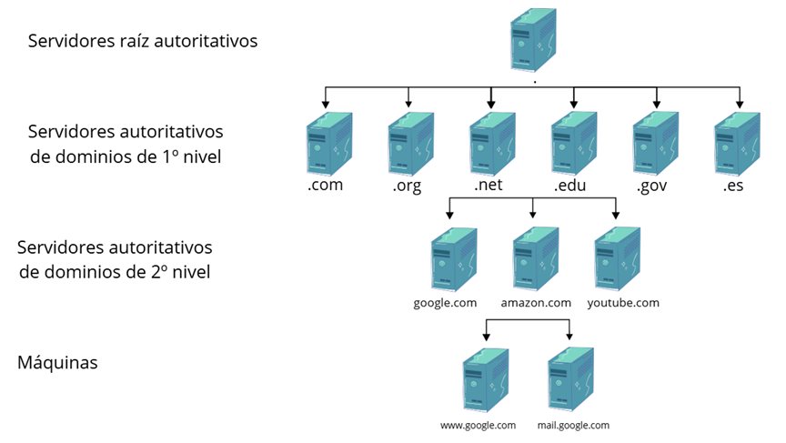

# DNS
DNS (Domain Name System) es un protocolo que traduce nombres de dominio legibles por humanos (www.ejemplo.com) en direcciones IP numéricas (192.0.2.1).  
Es el sistema que permite que podamos usar nombres en lugar de memorizar direcciones.

---
<br>


## 1. DNS Tree 🌳
- La estructura del DNS se organiza en un árbol jerárquico.
- Cada nivel conoce únicamente a los servidores autoritativos del nivel inmediatamente inferior.
- Los principales niveles son:
    1. **Raíz:** Representada por un punto (.)
    2. **Dominios de Nivel Superior (TLD):** .com, .org, .net, .edu, .gov, .es.
    3. **Dominios de Segundo Nivel:** google.com, universidad.edu, gobierno.gov.
    4. **Subdominios:** mail.google.com, cs.universidad.edu.


- Si un equipo quiere acceder a la dirección de `www.ejemplo.es`, el proceso es:
    1. **Caché local:** Comprueba si ya tiene la respuesta guardada.
    2. **Archivo hosts:** Si no está en caché, mira si está definido manualmente en `/etc/hosts` (o `C:\Windows\System32\drivers\etc\hosts`).
    3. **Servidor DNS configurado:** Si este servidor ya tiene la respuesta en su propia caché, la devuelve directamente.
    4. **Búsqueda iterativa (si no está en caché):**
       - Pregunta a los **servidores raíz**, que le indican cuáles son los autoritativos del TLD `.es`.
       - Pregunta a los **autoritativos de .es**, que le indican cuáles son los autoritativos del dominio `ejemplo.es`.
       - Pregunta al **servidor autoritativo de ejemplo.es**, que finalmente responde con la IP de `www.ejemplo.es`.
---
<br>


## 2. Instalación ⚙️
```bash
sudo apt update             # Actualizar la lista de paquetes.
sudo apt install bind9      # Instala el servidor DNS BIND9.
sudo apt install bind9utils # Instala utilidades para BIND9.
sudo apt install bind9-doc  # Instala la documentación de BIND9.
sudo apt install dnsutils   # Instala herramientas de cliente DNS.
```
---
<br>


## 3. Configuración 🔧
### 3.1. Opciones principales
```bash
nano /etc/bind/named.conf.options
```
- `directory`: Indica el directorio donde se ubicará la caché de consultas.
- `forwarders`: Indica los servidores DNS a los que se dirigirán las consultas en caso de que se esté configurando un servidor de solo caché (de reenvío).
- `listen-on`: Indica el puerto (y/o las IPs) desde el que escuchará el servidor DNS.
- `recursion`: Indica si el servidor acepta o no consultas recursivas.
  - `yes`: Permite consultas recursivas.
  - `no`: No permite consultas recursivas.
- `dnssec-validation`: Configura la validación DNSSEC. Valores comunes:
  - `yes`: habilita la validación.
  - `no`: desactiva la validación.
  - `auto`: gestiona automáticamente las claves de confianza (recomendado; usa la clave de confianza de la raíz).
- `auth-nxdomain`: Indica el comportamiento de nuestro servidor DNS cuando no consigue encontrar información sobre un dominio.
  - `yes`: el servidor responde con un mensaje de error NXDOMAIN cuando no encuentra un dominio.
  - `no`: el servidor responde con una respuesta vacía en lugar de NXDOMAIN.
- `allow-transfer`: Indica si se habilitan o no las transferencias de zona master/slave.
  - `{ any; }`: Permite transferencias de zona desde cualquier IP.
  - `{ none; }`: No permite transferencias de zona.
  - `{ localhost; }`: Permite transferencias de zona solo desde la máquina local.
  - `{ localnets; }`: Permite transferencias de zona desde las redes locales.
- `allow-query`: Indica una medida de seguridad para restringir desde qué equipos se permite realizar consultas DNS al servidor.
  - `{ any; }`: Permite consultas desde cualquier IP.
  - `{ none; }`: No permite consultas desde ninguna IP.
  - `{ localhost; }`: Permite consultas solo desde la máquina local.
  - `{ localnets; }`: Permite consultas desde las redes locales.

### 3.2. Configuración de zonas
```bash
# nano /etc/bind/named.conf.local
zone "example.com" {
	type master;                     # Tipo de zona.
	file "/etc/bind/db.example.com"; # Archivo de zona.
};

zone "0.168.192.in-addr.arpa" {
    type master;                     # Tipo de zona inversa.
    file "/etc/bind/db.192.168.0";   # Archivo de zona inversa.
};

zone "0.10.10.in-addr.arpa" {
    type master;                     # Tipo de zona inversa.
    file "/etc/bind/db.10.10.0";     # Archivo de zona inversa.
};
```
---
<br>


## 4. Archivos de zona 📁
- `SOA (Start of Authority)`: Define el inicio de la zona y contiene información administrativa.
- `NS (Name Server)`: Especifica los servidores de nombres para la zona.
- `A (Address)`: Mapea un nombre de dominio a una dirección IPv4.
- `CNAME (Canonical Name)`: Crea un alias para otro nombre de dominio.
- `MX (Mail Exchange)`: Define los servidores de correo para la zona.
- `PTR (Pointer)`: Mapea una dirección IP a un nombre de dominio (usado en zonas inversas).
```bash
# nano /etc/bind/db.example.com
; Fichero de zona para example.com
$ORIGIN example.com.
$TTL 1D
@         IN  SOA  internal  admin.dmz( 201912171 8H 4H 4W 1D ) # Serial , Refresh, Retry, Expire, Minimum TTL
          IN  NS   internal
          IN  MX   10        dmz
          IN  A	   192.168.0.254

internal  IN  A    192.168.0.254

dmz       IN  A	   10.10.0.254

router    IN  A	   192.168.0.1
          IN  A	   10.10.0.1

windows   IN  A    192.168.0.253


gateway   IN  CNAME  router
samba     IN  CNAME  internal
win2012   IN  CNAME  windows
ftp	      IN  CNAME  dmz
www	      IN  CNAME  dmz
smtp      IN  CNAME  dmz
pop3      IN  CNAME  dmz
moodle    IN  CNAME  dmz


# nano /etc/bind/db.192.168.0
; Fichero de zona inversa para la red 192.168.0.0/24
$ORIGIN 0.168.192.in-addr.arpa.
$TTL 1D
@         IN  SOA  internal  admin.dmz( 201912171 8H 4H 4W 1D )
          IN  NS   internal
1         IN  PTR  router.example.com.
253       IN  PTR  windows.example.com.
254       IN  PTR  internal.example.com.

# nano /etc/bind/db.10.10.0
; Fichero de zona inversa para la red 10.10.0.0/24
$ORIGIN 0.10.10.in-addr.arpa.
$TTL 1D
@         IN  SOA  dmz  admin.dmz( 201912171 8H 4H 4W 1D )
          IN  NS   dmz
1         IN  PTR  router.example.com.
254       IN  PTR  dmz.example.com.
```
---
<br>


## 5. Comprobación de archivos ✅
```bash
named-checkconf named.conf.local                               # Comprueba la sintaxis del archivo de configuración principal.
named-checkzone example.com /etc/bind/db.example.com           # Comprueba la sintaxis del archivo de zona directa.
named-checkzone 0.168.192.in-addr.arpa /etc/bind/db.192.168.0  # Comprueba la sintaxis del archivo de zona inversa.
named-checkzone 0.10.10.in-addr.arpa /etc/bind/db.10.10.0      # Comprueba la sintaxis del archivo de zona inversa.
```
---
<br>


## 6. Eliminar la caché 🧹
```bash
ipconfig /flushdns         # Windows: Elimina la caché DNS del cliente.
/etc/init.d/nscd restart   # Linux: Reinicia el servicio de caché de nombres (nscd).
rndc flush                 # Elimina toda la caché del servidor DNS.
rndc flushname example.com # Elimina la caché de un dominio específico.
```
---
<br>


## 7. Configuración de nombres cortos 📝
- En Windows: Equipo >> Propiedades >> Cambiar configuración >> Cambiar >> Más...
- En Linux: `nano /etc/resolv.conf`
---
<br>


## 8 Comandos de consulta DNS 🔍
```bash
nslookup router       # Resuelve IP
nslookup 192.168.0.1  # Resolución inversa
nslookup
	>set type=SOA     # Muestra información sobre el registro SOA
	>set type=MX      # Muestra información sobre el servidor de correo
	>example.com

dig                   # Muestra un listado de los servidores raíz
dig router            # Resuelve IP
dig -x 192.168.0.1    # Resolución inversa
dig example.com SOA   # Muestra información sobre el registro SOA
dig example.com MX    # Muestra información sobre el servidor de correo

host router           # Resuelve IP
host 192.168.0.1      # Resolución inversa
host -t SOA           # Muestra información sobre el registro SOA
```
<br><br><br>

## *[volver al índice](../README.md)*