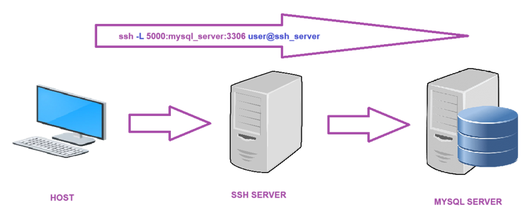

# SSH
SSH (Secure Shell) es un protocolo de red que permite a los administradores de sistemas acceder y administrar remotamente sus servidores en una forma segura.

## 1. Instalación ⚙️
```bash
sudo apt install ssh            # Instala servidor y cliente.
sudo apt install openssh-client # Instala cliente.
sudo apt install openssh-server # Instala servidor.
```
---
<br>

## 2. Configuración 🔧
### Configuración del cliente
```bash
sudo nano /etc/ssh/ssh_config
```
- En la configuración del cliente las principales cosas que se pueden cambiar son:
  - `Host`: dirección IP o nombre de dominio del servidor
  - `HostName`: dirección IP o nombre de dominio del servidor
  - `User`: usuario con el que se va a conectar
  - `Port`: puerto del servidor
  - `IdentityFile`: archivo de clave privada
  - `ServerAliveInterval`: tiempo de espera para mantener la conexión
  - `ServerAliveCountMax`: número de intentos de conexión
  - `StrictHostKeyChecking`: comprobación de la clave del servidor
  - `PasswordAuthentication`: autenticación por contraseña
  - `PubkeyAuthentication`: autenticación por clave pública
  - `ForwardAgent`: reenvío de la clave privada
  - `ForwardX11`: reenvío de X11
  - `LogLevel`: nivel de registro
  - `Compression`: compresión de datos

### Configuración del servidor
```bash
sudo nano /etc/ssh/sshd_config
```
- En la configuración del servidor las principales cosas que se pueden cambiar son:
  - `Port`: puerto del servidor
  - `ListenAddress`: dirección IP del servidor
  - `HostKey`: archivo de clave privada
  - `PermitRootLogin`: acceso de root
  - `PasswordAuthentication`: autenticación por contraseña
  - `PermitEmptyPasswords`: contraseñas vacías
  - `PermitUserEnvironment`: variables de entorno
  - `UsePAM`: módulo de autenticación
  - `AllowTcpForwarding`: reenvío de puertos
  - `X11Forwarding`: reenvío de X11
  - `PrintMotd`: mensaje del día
  - `Banner`: banner de bienvenida
  - `Subsystem`: subsistema de comandos
  - `UseDNS`: resolución de nombres
  - `PermitTunnel`: túneles VPN
  - `Compression`: compresión de datos
  - `ClientAliveInterval`: tiempo de espera para mantener la conexión
  - `ClientAliveCountMax`: número de intentos de conexión
  - `MaxAuthTries`: número de intentos de autenticación
  - `MaxSessions`: número de sesiones
  - `LogLevel`: nivel de registro
---
<br>

## 3.Comandos 📜
```bash
# ssh-keygen
ssh-keygen -t rsa -b 4096 -C "test@gmail.com" # Generar un par de claves RSA.
ssh-keygen -t ed25519 -C "test@gmail.com"     # Generar un par de claves Ed25519 (no requiere longitud).
ssh-keygen -f key -y                         # Extraer la clave pública de una clave privada.
ssh-keygen -l -f key.pub                      # Mostrar la huella digital de una clave pública (fingerprint).

# ssh
ssh user@host                                 # Conectarse a un servidor.
ssh -l user host                              # Conectarse a un servidor con un usuario específico.
ssh -p port user@host                         # Conectarse a un servidor en un puerto específico.
ssh -i key user@host                          # Conectarse a un servidor con una clave privada.
ssh -t user@host command                      # Ejecutar un comando en el servidor.
ssh-copy-id user@host                         # Copiar la clave pública al servidor.

# scp
scp file user@host:destination                # Copiar un archivo al servidor.
```
---
<br>

## 4. Tunneling 🔗
### Local Port Forwarding
Redirige el tráfico de un puerto específico en tu máquina local a otro puerto en un servidor remoto.
```bash
# ssh -L [local_host]:[local_port]:[destination_host]:[destination_port] [user]@[ssh_server]
# localhost es el servidor remoto.
ssh -L 8080:localhost:80 richy@192.168.0.254

# Accede al puerto 80 del servidor remoto a través del puerto 8080 de tu máquina local:
# localhost es tu máquina local.
http://localhost:8080 
```

```bash
# N: no ejecuta comandos remotos.
# f: ejecuta en segundo plano.
ssh -L -Nf 0.0.0.0:5000:10.10.10.254:3306 richy@192.168.0.254

# Accede al puerto 3306 del servidor remoto a través del puerto 5000 de tu máquina local:
mysql -h localhost -P 5000 -u richard -p
```
<br>

### Remote Port Forwarding
Permite a los usuarios remotos acceder a servicios en tu máquina local.
```bash
ssh -R [remote_port]:[local_host]:[local_port] [user]@[ssh_server]
ssh -R 8080:localhost:80 richy@192.168.0.254

# Los usuarios remotos pueden acceder al puerto 80 de tu máquina local a través del puerto 8080 del servidor remoto:
http://192.168.0.250:8080
```
<br>

### Dynamic Port Forwarding
Crea un proxy SOCKS en un puerto local que puedes configurar en tu navegador o cliente para enrutar dinámicamente el tráfico a través del túnel SSH.  
Esto es útil para eludir restricciones de red o censura.
```bash
ssh -D [local_port] [user]@[ssh_server]
ssh -D 8080 richy@192.168.0.250

# Configura tu navegador para usar el proxy SOCKS en localhost:
Chrome -> Configuración -> Avanzado -> Red -> Abrir configuración de proxy -> Configuración de LAN -> Usar un servidor proxy
```
---
<br>

## 5. Reeenvío de X11 🖥️
Permite a los usuarios ejecutar aplicaciones gráficas en un servidor remoto y verlas en su máquina local.
```bash
# /etc/ssh/sshd_config
X11Forwarding yes    # Habilita el reenvío de X11.
X11DisplayOffset 10  # Número de visualización de X11
X11UseLocalhost no   # Usa la dirección IP del cliente y no solo localhost.

sudo systemctl restart ssh

# Terminal
ssh -X user@host     # Conectarse al servidor con reenvío de X11.
```
<br><br><br>

## *[volver al índice](../README.md)*